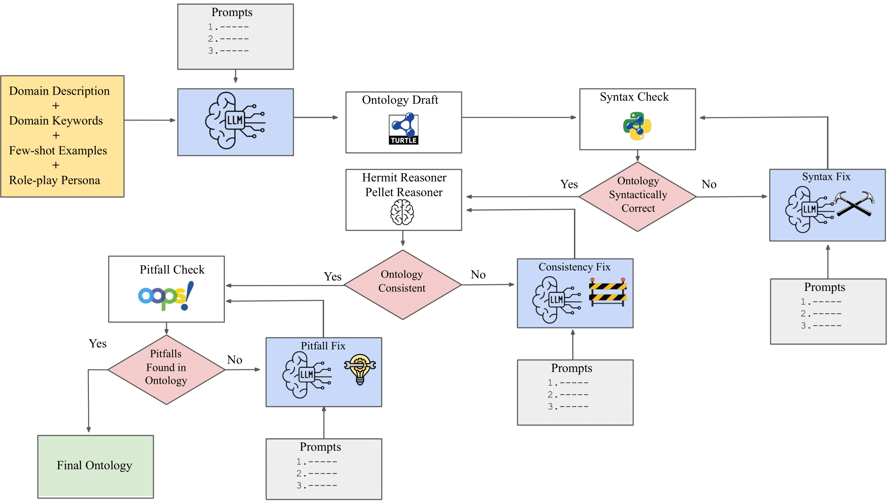

# From GPT to Mistral: Cross-Domain Ontology Learning with NeOn-GPT

Large Language Models (LLMs) offer promising capabilities for automating ontology engineering tasks; however, existing approaches often focus on isolated knowledge extraction rather than comprehensive ontology construction. In this paper, we present an extended version of NeOn-GPT, a pipeline that integrates prompt-engineered LLM interactions within the structured NeOn ontology engineering methodology. Building on our prior work, we enhance the pipeline with improved prompting strategies, support for ontology reuse, and more robust validation mechanisms. We apply the updated pipeline across four domains—wine, sewer networks, cheminformatics, and environmental microbiology—using both proprietary (GPT-4o) and open-source (Mistral, Deepseek, LLama) LLMs to evaluate model and domain generalization. The resulting ontologies are assessed against expert-curated gold standards using structural, lexical, and semantic metrics. Our results highlight the domain-specific strengths and limitations of different LLMs, revealing that while models can capture relevant concepts and properties (relations), challenges remain in lexical alignment, depth of hierarchy, and semantic precision. This work presents a comprehensive framework for evaluating LLM-based ontology generation, providing practical insights for enhancing the quality and scalability of ontology learning pipelines.  The process involves the following stages: 

 ✍️ **1. Ontology Draft Generation**

This stage begins with structured inputs: a domain description, a curated set of few-shot examples, and a carefully crafted role-play persona that primes the LLM to act as a domain expert. Guided by these inputs, the model is prompted to define the ontology’s purpose, scope, and intended users, which leads to the generation of competency questions—natural language queries that the final ontology should be able to answer. The LLM extracts key domain entities and relations from these questions, building a conceptual model with hierarchical class structures. The pipeline then supports the reuse of existing ontologies by integrating relevant fragments directly into the prompt. Finally, the model enriches this conceptual representation with formal axioms, descriptive metadata, and named individuals. The result of this stage is a complete ontology draft serialized in Turtle syntax. 

  

 Figure 1: Ontology draft generation pipeline guided by domain description, few-shot examples, and expert role-play prompting.

 🔁 **2. NeOn-GPT pipeline**

Once the draft is generated, it is passed through a three-stage validation and refinement process: (a) syntax checking using RDFLib, (b) logical consistency verification with OWL reasoners such as HermiT and Pellet, and (c) pitfall detection using the OOPS! Framework. Errors identified by these tools—such as syntax violations, unsatisfiable classes, or modeling pitfalls—are fed back to the LLM as diagnostic prompts. The model is then prompted to revise and repair the ontology, enabling an iterative refinement loop that produces a syntactically valid, logically consistent, and semantically robust output.

  

 Figure 2: Full NeOn-GPT workflow showing ontology generation, validation, and iterative refinement using LLM prompts guided by diagnostic feedback from RDFLib, OWL reasoners, and OOPS!

📊 **3. Ontology Evaluation Framework**

We evaluate generated ontologies against expert-developed gold standards using a three-part framework: (a) Structural metrics: Entity counts, hierarchy depth, and axiom coverage; (b) Lexical analysis: Name overlap and string similarity; and (c) Semantic similarity, Embedding-based comparisons via Sentence Transformers.

  

Figure 3: Ontology evaluation framework combining structural analysis, lexical matching, and semantic similarity to compare LLM-generated ontologies against expert-developed gold standards.

 **🗂️ Directory Overview**

- **`images/`**: Visual figures used in `README.md`.
- **`neon-gpt/`**: Core scripts for ontology generation and validation.
  - **`api_utils.py`**: This script contains utility functions for API communication, especially for working with external services like the OpenRouter API or other APIs used in the project. The functions include sending requests and handling responses.
  - **`ontology_utils.py`**: This script handles ontology-related tasks, primarily for creating and managing Turtle (.ttl) files. It helps with saving and appending Turtle code generated from model responses.
  - **`neon_gpt_ontology_generation.py`**: This script is responsible for generating ontologies using NeOn-GPT methodology.
  - **`validate_fix_ontology_syntax.py`**: This script deals with validating and fixing the syntax of an ontology. It checks for syntactic errors in RDF/OWL files and attempts to repair or reformat the ontology to ensure it adheres to the correct syntax rules using LLM-based correction introduced in the NeOn-GPT methodology. 
  - **`validate_fix_ontology_consistency.py`**: This script is used to validate the consistency of an ontology. This script ensures compatibility with OWL standards. It interacts with reasoners like HermiT and the ROBOT tool to verify logical coherence and consistency in the ontology. If any inconsistencies are found, the script attempts to automatically correct them using an LLM-based approach introduced in the NeOn-GPT methodology.
  
- **`results/`**:
  - **`gpt-4o-ontologies/`**: Ontologies generated using GPT-4o across multiple domains, including environmental microbiology (AquaDiva), cheminformatics, urban infrastructure (SewerNet), and viticulture (wine).
  - **`mistral-ontologies/`**: Ontologies generated using Mistral across multiple domains, including environmental microbiology (AquaDiva), cheminformatics, urban infrastructure (SewerNet), and viticulture (wine).
  - **`llama4-ontologies/`**: Ontologies generated using Llama4-maverick-17b-128e-instruct across multiple domains, including environmental microbiology (AquaDiva), cheminformatics, urban infrastructure (SewerNet), and viticulture (wine).
  - **`deepseek-ontologies/`**: Ontologies generated using DeepSeek-v3.2-exp across multiple domains, including environmental microbiology (AquaDiva), cheminformatics, urban infrastructure (SewerNet), and viticulture (wine).
 
- **`eval/`**:
  - **`llm_vs_goldstandard_ontology_analyzer_script.py`**: structural comparison of gold standard ontology and llm-generated ontology
  - **`semantic_eval.py`**: semantic comparison of gold standard ontology and llm-generated ontology
  - **`lexical_eval.py`**: lexical comparison of gold standard ontology and llm-generated ontology

- **`LICENSE`**: Project license.
- **`README.md`**: Project description and usage instructions.

