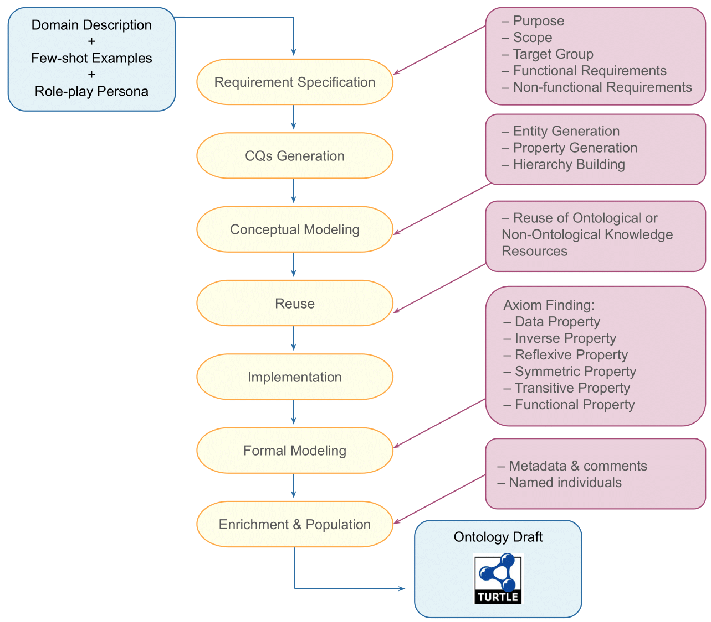
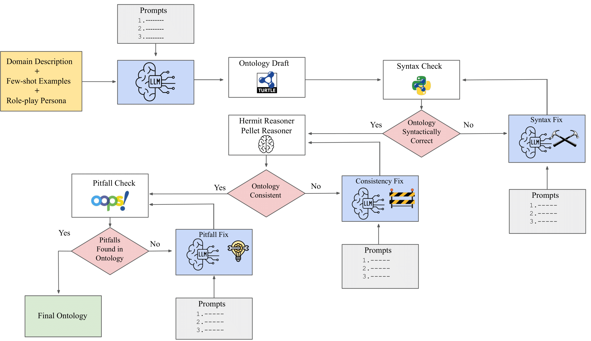
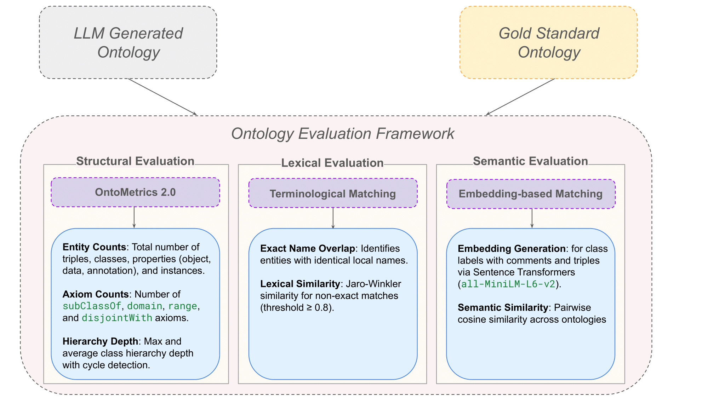

# From GPT to Mistral: Cross-Domain Ontology Learning with NeOn-GPT

Large Language Models (LLMs) offer promising capabilities for automating ontology engineering tasks, yet existing approaches often focus on isolated knowledge extraction rather than full ontology construction. In this paper, we present an extended version of NeOn-GPT, a pipeline that integrates prompt-engineered LLM interactions within the structured NeOn ontology engineering methodology. Building on our prior work, we enhance the pipeline with improved prompting strategies, support for ontology reuse, and more robust validation mechanisms. We apply the updated pipeline across four domains—wine, sewer networks, cheminformatics, and environmental microbiology—using both proprietary (GPT-4o) and open-source (Mistral) LLMs to evaluate model and domain generalization. The resulting ontologies are assessed against expert-curated gold standards using structural, lexical, and semantic metrics. Our results highlight domain-specific strengths and limitations of different LLMs, revealing that while models can capture relevant concepts and properties (relations), challenges remain in lexical alignment, hierarchy depth, and semantic precision. This work provides a comprehensive framework for evaluating LLM-based ontology generation and offers practical insights for improving the quality and scalability of ontology learning pipelines.  The process involves the following stages: 

 ✍️ **1. Ontology Draft Generation**

This stage begins with structured inputs: a domain description, a curated set of few-shot examples, and a carefully crafted role-play persona that primes the LLM to act as a domain expert. Guided by these inputs, the model is prompted to define the ontology’s purpose, scope, and intended users, which leads to the generation of competency questions—natural language queries that the final ontology should be able to answer. The LLM extracts key domain entities and relations from these questions, building a conceptual model with hierarchical class structures. The pipeline then supports the partial reuse of existing ontologies by integrating relevant fragments directly into the prompt. Finally, the model enriches this conceptual representation with formal axioms, descriptive metadata, and named individuals. The result of this stage is a complete ontology draft serialized in Turtle syntax. 

  

 Figure 1: Ontology draft generation pipeline guided by domain description, few-shot examples, and expert role-play prompting.

 🔁 **2. Validation Workflow**

Once the draft is generated, it is passed through a three-stage validation and refinement process: (a) syntax checking using RDFLib, (b) logical consistency verification with OWL reasoners such as HermiT and Pellet, and (c) pitfall detection using the OOPS! Framework. Errors identified by these tools—such as syntax violations, unsatisfiable classes, or modeling pitfalls—are fed back to the LLM as diagnostic prompts. The model is then prompted to revise and repair the ontology, enabling an iterative refinement loop that produces a syntactically valid, logically consistent, and semantically robust output.

  

 Figure 2: Full NeOn-GPT workflow showing ontology generation, validation, and iterative refinement using LLM prompts guided by diagnostic feedback from RDFLib, OWL reasoners, and OOPS!

📊 **3. Ontology Evaluation Framework**

We evaluate generated ontologies against expert-developed gold standards using a three-part framework: (a) Structural metrics: Entity counts, hierarchy depth, and axiom coverage; (b) Lexical analysis: Name overlap and string similarity; and (c) Semantic similarity, Embedding-based comparisons via Sentence Transformers.

  

Figure 3: Ontology evaluation framework combining structural analysis, lexical matching, and semantic similarity to compare LLM-generated ontologies against expert-developed gold standards.

 **🗂️ Directory Overview**

- **`images/`**: Visual figures used in `README.md`.
- **`neon-gpt/`**: Core scripts for ontology generation and validation.
  - **`neon_gpt_extended.py`**: Script for generating ontology drafts from structured NeOn-GPT prompts and inputs, with output saved in Turtle (`.ttl`) format.
  - **`ontology_validation_syntax_consistency_pitfall.py`**: Performs ontology validation including syntax checking (RDFLib), logical consistency (OWL reasoners: HermiT, Pellet), and modeling pitfall detection (e.g., missing labels, cyclic subclassing, disjointness) using our custom built module and OOPS!.
  - Includes the HermiT reasoner JAR.
- **`results/`**:
  - **`gpt-4o-ontologies/`**: Ontologies generated using GPT-4o across multiple domains, including environmental microbiology (AquaDiva), cheminformatics, urban infrastructure (SewerNet), and viticulture (wine).
  - **`mistral-ontologies/`**: Ontologies generated using Mistral across multiple domains, including environmental microbiology (AquaDiva), cheminformatics, urban infrastructure (SewerNet), and viticulture (wine).
- **`LICENSE`**: Project license.
- **`README.md`**: Project description and usage instructions.

